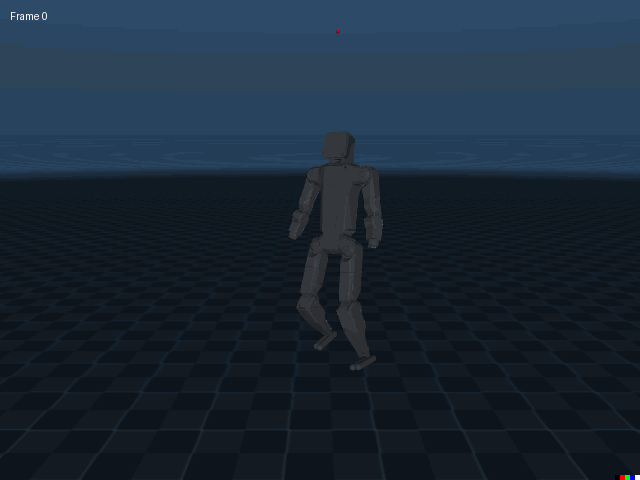

<div align="center">
<h1>K-Sim</h1>
<p>Welcome to <code>ksim</code>, a modular and easy-to-use framework for training policies in simulation.</p>
<h3>
  <a href="https://url.kscale.dev/docs">Docs</a> ·
  <a href="https://url.kscale.dev/discord">Discord</a>
</h3>

</div>

## Installation

To install the framework:

```
pip install ksim
```

Make sure to install [JAX](https://github.com/google/jax#installation) correctly for your hardware (CPU or GPU). We recommend using `conda` rather than `uv` to avoid compatibility issues with MuJoCo on macOS.

---

## Running the Walking Example

A default walking environment is defined in `examples/walking.py`. To train a walking policy, simply run:

```
python -m examples.walking
```

This launches PPO training on the default humanoid with 2048 parallel environments, a rollout horizon of 8 seconds, and a small feedforward policy trained using a mixture of Gaussians.

### Lowering Memory Usage

If you are on a Mac or a system with less memory:

```
python -m examples.walking num_envs=8 batch_size=4
```

---

## Visualizing the Environment

To visualize the behavior of a policy:

```
python -m examples.walking run_mode=view
```

This will launch a rendering window and run the policy in real time. To run for a fixed amount of time:

```
python -m examples.walking run_mode=view viewer_num_seconds=10
```

Use `viewer_argmax_action=True` to visualize the deterministic policy.

---

## Anatomy of `walking.py`

### Task Definition

The walking task is implemented via `HumanoidWalkingTask`, which inherits from `ksim.PPOTask`. This class defines:

- A default MuJoCo model (`scene.mjcf`)
- Observations: joint positions, velocities, forces, base pose, IMU sensors, and contact info
- Randomizations: friction, masses, armatures, and zero positions
- Rewards: joystick or naive forward walking
- Terminations: roll, pitch, Z height, velocity limits
- Curriculum: episode length

<details>
  <summary>HumanoidWalkingTask Implementation</summary>

```python
class HumanoidWalkingTask(ksim.PPOTask[Config], Generic[Config]):
    def get_mujoco_model(self) -> mujoco.MjModel:
        mjcf_path = (Path(__file__).parent / "data" / "scene.mjcf").resolve().as_posix()
        return mujoco.MjModel.from_xml_path(mjcf_path)

    def get_mujoco_model_metadata(self, mj_model: mujoco.MjModel) -> ksim.Metadata:
        return ksim.Metadata.from_model(
            mj_model,
            kp=self.config.kp,
            kd=self.config.kd,
            armature=self.config.armature,
            friction=self.config.friction,
        )

    def get_actuators(
        self,
        physics_model: ksim.PhysicsModel,
        metadata: dict[str, JointMetadataOutput] | None = None,
    ) -> ksim.Actuators:
        assert metadata is not None, "Metadata is required"
        return ksim.MITPositionActuators(
            physics_model=physics_model,
            joint_name_to_metadata=metadata,
        )

    def get_physics_randomizers(self, physics_model: ksim.PhysicsModel) -> list[ksim.PhysicsRandomizer]:
        return [
            ksim.StaticFrictionRandomizer(),
            ksim.ArmatureRandomizer(),
            ksim.MassMultiplicationRandomizer.from_body_name(physics_model, "torso"),
            ksim.JointDampingRandomizer(),
            ksim.JointZeroPositionRandomizer(),
        ]

    def get_events(self, physics_model: ksim.PhysicsModel) -> list[ksim.Event]:
        return [
            ksim.PushEvent(
                x_force=1.0,
                y_force=1.0,
                z_force=0.0,
                x_angular_force=0.1,
                y_angular_force=0.1,
                z_angular_force=0.3,
                interval_range=(0.25, 0.75),
            ),
        ]

    def get_resets(self, physics_model: ksim.PhysicsModel) -> list[ksim.Reset]:
        return [
            ksim.RandomJointPositionReset(),
            ksim.RandomJointVelocityReset(),
        ]

    def get_observations(self, physics_model: ksim.PhysicsModel) -> list[ksim.Observation]:
        return [
            ksim.JointPositionObservation(),
            ksim.JointVelocityObservation(),
            ksim.ActuatorForceObservation(),
            ksim.CenterOfMassInertiaObservation(),
            ksim.CenterOfMassVelocityObservation(),
            ksim.BasePositionObservation(),
            ksim.BaseOrientationObservation(),
            ksim.BaseLinearVelocityObservation(),
            ksim.BaseAngularVelocityObservation(),
            ksim.BaseLinearAccelerationObservation(),
            ksim.BaseAngularAccelerationObservation(),
            ksim.ProjectedGravityObservation.create(
                physics_model=physics_model,
                framequat_name="orientation",
            ),
            ksim.ActuatorAccelerationObservation(),
            ksim.SensorObservation.create(physics_model=physics_model, sensor_name="imu_acc"),
            ksim.SensorObservation.create(physics_model=physics_model, sensor_name="imu_gyro"),
            ksim.SensorObservation.create(physics_model=physics_model, sensor_name="local_linvel"),
            ksim.SensorObservation.create(physics_model=physics_model, sensor_name="upvector"),
            ksim.SensorObservation.create(physics_model=physics_model, sensor_name="forwardvector"),
            ksim.SensorObservation.create(physics_model=physics_model, sensor_name="global_linvel"),
            ksim.SensorObservation.create(physics_model=physics_model, sensor_name="global_angvel"),
            ksim.SensorObservation.create(physics_model=physics_model, sensor_name="position"),
            ksim.SensorObservation.create(physics_model=physics_model, sensor_name="orientation"),
            ksim.SensorObservation.create(physics_model=physics_model, sensor_name="right_foot_global_linvel"),
            ksim.SensorObservation.create(physics_model=physics_model, sensor_name="left_foot_global_linvel"),
            ksim.SensorObservation.create(physics_model=physics_model, sensor_name="left_foot_upvector"),
            ksim.SensorObservation.create(physics_model=physics_model, sensor_name="right_foot_upvector"),
            ksim.SensorObservation.create(physics_model=physics_model, sensor_name="left_foot_pos"),
            ksim.SensorObservation.create(physics_model=physics_model, sensor_name="right_foot_pos"),
            ksim.FeetContactObservation.create(
                physics_model=physics_model,
                foot_left_geom_names=["foot_left"],
                foot_right_geom_names=["foot_right"],
                floor_geom_names=["floor"],
            ),
            ksim.FeetPositionObservation.create(
                physics_model=physics_model,
                foot_left_body_name="foot_left",
                foot_right_body_name="foot_right",
            ),
            ksim.FeetOrientationObservation.create(
                physics_model=physics_model,
                foot_left_body_name="foot_left",
                foot_right_body_name="foot_right",
            ),
            ksim.TimestepObservation(),
        ]

    def get_commands(self, physics_model: ksim.PhysicsModel) -> list[ksim.Command]:
        return [
            (
                ksim.JoystickCommand(
                    ranges=((0, 1),) if self.config.move_forward_command else ((0, 4),),
                    switch_prob=self.config.ctrl_dt / 5,  # Switch every 5 seconds, on average.
                )
            ),
        ]

    def get_rewards(self, physics_model: ksim.PhysicsModel) -> list[ksim.Reward]:
        rewards: list[ksim.Reward] = [
            ksim.StayAliveReward(scale=1.0),
            ksim.XYAngularVelocityPenalty(scale=-0.001),
        ]

        if self.config.naive_forward_reward:
            rewards += [
                ksim.NaiveForwardReward(
                    scale=1.0,
                ),
            ]

        else:
            rewards += [
                ksim.JoystickReward(
                    linear_velocity_clip_max=self.config.linear_velocity_clip_max,
                    angular_velocity_clip_max=self.config.angular_velocity_clip_max,
                    command_name="joystick_command",
                    scale=1.0,
                ),
            ]

        return rewards

    def get_terminations(self, physics_model: ksim.PhysicsModel) -> list[ksim.Termination]:
        return [
            ksim.BadZTermination(unhealthy_z_lower=0.9, unhealthy_z_upper=1.6),
            ksim.NotUprightTermination(max_radians=math.pi / 3),
            ksim.FastAccelerationTermination(),
            ksim.FarFromOriginTermination(max_dist=10.0),
        ]

    def get_curriculum(self, physics_model: ksim.PhysicsModel) -> ksim.Curriculum:
        return ksim.EpisodeLengthCurriculum(
            num_levels=self.config.num_curriculum_levels,
            increase_threshold=self.config.increase_threshold,
            decrease_threshold=self.config.decrease_threshold,
            min_level_steps=self.config.min_level_steps,
        )
```

</details>

### Model Definition and Integration

<details>
  <summary>Model Definition and Integration</summary>

```python
NUM_JOINTS = 21

class DefaultHumanoidActor(eqx.Module):
    """Actor for the walking task."""

    mlp: eqx.nn.MLP
    min_std: float = eqx.static_field()
    max_std: float = eqx.static_field()
    var_scale: float = eqx.static_field()
    num_mixtures: int = eqx.static_field()

    def __init__(
        self,
        key: PRNGKeyArray,
        *,
        min_std: float,
        max_std: float,
        var_scale: float,
        hidden_size: int,
        depth: int,
        num_mixtures: int,
    ) -> None:
        num_inputs = NUM_INPUTS
        num_outputs = NUM_JOINTS

        self.mlp = eqx.nn.MLP(
            in_size=num_inputs,
            out_size=num_outputs * 3 * num_mixtures,
            width_size=hidden_size,
            depth=depth,
            key=key,
            activation=jax.nn.relu,
        )
        self.min_std = min_std
        self.max_std = max_std
        self.var_scale = var_scale
        self.num_mixtures = num_mixtures

    def forward(self, obs_n: Array) -> distrax.Distribution:
        prediction_n = self.mlp(obs_n)

        # Splits the predictions into means, standard deviations, and logits.
        slice_len = NUM_JOINTS * self.num_mixtures
        mean_nm = prediction_n[:slice_len].reshape(NUM_JOINTS, self.num_mixtures)
        std_nm = prediction_n[slice_len : slice_len * 2].reshape(NUM_JOINTS, self.num_mixtures)
        logits_nm = prediction_n[slice_len * 2 :].reshape(NUM_JOINTS, self.num_mixtures)

        # Softplus and clip to ensure positive standard deviations.
        std_nm = jnp.clip((jax.nn.softplus(std_nm) + self.min_std) * self.var_scale, max=self.max_std)
        dist_n = ksim.MixtureOfGaussians(means_nm=mean_nm, stds_nm=std_nm, logits_nm=logits_nm)
        return dist_n


class DefaultHumanoidCritic(eqx.Module):
    """Critic for the walking task."""

    mlp: eqx.nn.MLP

    def __init__(
        self,
        key: PRNGKeyArray,
        *,
        hidden_size: int,
        depth: int,
    ) -> None:
        num_inputs = NUM_INPUTS
        num_outputs = 1

        self.mlp = eqx.nn.MLP(
            in_size=num_inputs,
            out_size=num_outputs,
            width_size=hidden_size,
            depth=depth,
            key=key,
            activation=jax.nn.relu,
        )

    def forward(self, obs_n: Array) -> Array:
        return self.mlp(obs_n)


class DefaultHumanoidModel(eqx.Module):
    actor: DefaultHumanoidActor
    critic: DefaultHumanoidCritic

    def __init__(
        self,
        key: PRNGKeyArray,
        *,
        hidden_size: int,
        depth: int,
        num_mixtures: int,
    ) -> None:
        self.actor = DefaultHumanoidActor(
            key,
            min_std=0.01,
            max_std=1.0,
            var_scale=0.5,
            hidden_size=hidden_size,
            depth=depth,
            num_mixtures=num_mixtures,
        )
        self.critic = DefaultHumanoidCritic(
            key,
            hidden_size=hidden_size,
            depth=depth,
        )
```

</details>

### Integration with the Task

<details>
  <summary>Integration with the Task</summary>

```python
class HumanoidWalkingTask(ksim.PPOTask[Config], Generic[Config]):
    def get_optimizer(self) -> optax.GradientTransformation:
        optimizer = optax.chain(
            optax.clip_by_global_norm(self.config.max_grad_norm),
            (
                optax.adam(self.config.learning_rate)
                if self.config.adam_weight_decay == 0.0
                else optax.adamw(self.config.learning_rate, weight_decay=self.config.adam_weight_decay)
            ),
        )

        return optimizer

    def get_model(self, key: PRNGKeyArray) -> DefaultHumanoidModel:
        return DefaultHumanoidModel(
            key,
            hidden_size=self.config.hidden_size,
            depth=self.config.depth,
            num_mixtures=self.config.num_mixtures,
        )

    def get_initial_model_carry(self, rng: PRNGKeyArray) -> None:
        return None

    def run_actor(
        self,
        model: DefaultHumanoidActor,
        observations: xax.FrozenDict[str, Array],
        commands: xax.FrozenDict[str, Array],
    ) -> distrax.Distribution:
        timestep_1 = observations["timestep_observation"]
        dh_joint_pos_j = observations["joint_position_observation"]
        dh_joint_vel_j = observations["joint_velocity_observation"]
        com_inertia_n = observations["center_of_mass_inertia_observation"]
        com_vel_n = observations["center_of_mass_velocity_observation"]
        imu_acc_3 = observations["sensor_observation_imu_acc"]
        imu_gyro_3 = observations["sensor_observation_imu_gyro"]
        proj_grav_3 = observations["projected_gravity_observation"]
        act_frc_obs_n = observations["actuator_force_observation"]
        base_pos_3 = observations["base_position_observation"]
        base_quat_4 = observations["base_orientation_observation"]
        lin_vel_obs_3 = observations["base_linear_velocity_observation"]
        ang_vel_obs_3 = observations["base_angular_velocity_observation"]
        joystick_cmd_1 = commands["joystick_command"]
        joystick_cmd_ohe_6 = jax.nn.one_hot(joystick_cmd_1, num_classes=6).squeeze(-2)

        obs_n = jnp.concatenate(
            [
                jnp.cos(timestep_1),  # 1
                jnp.sin(timestep_1),  # 1
                dh_joint_pos_j,  # NUM_JOINTS
                dh_joint_vel_j / 10.0,  # NUM_JOINTS
                com_inertia_n,  # 160
                com_vel_n,  # 96
                proj_grav_3,  # 3
                act_frc_obs_n / 100.0,  # NUM_JOINTS
                base_pos_3,  # 3
                base_quat_4,  # 4
                lin_vel_obs_3,  # 3
                ang_vel_obs_3,  # 3
                joystick_cmd_ohe_6,  # 6
            ],
            axis=-1,
        )

        return model.forward(obs_n)

    def run_critic(
        self,
        model: DefaultHumanoidCritic,
        observations: xax.FrozenDict[str, Array],
        commands: xax.FrozenDict[str, Array],
    ) -> Array:
        timestep_1 = observations["timestep_observation"]
        dh_joint_pos_j = observations["joint_position_observation"]
        dh_joint_vel_j = observations["joint_velocity_observation"]
        com_inertia_n = observations["center_of_mass_inertia_observation"]
        com_vel_n = observations["center_of_mass_velocity_observation"]
        imu_acc_3 = observations["sensor_observation_imu_acc"]
        imu_gyro_3 = observations["sensor_observation_imu_gyro"]
        proj_grav_3 = observations["projected_gravity_observation"]
        act_frc_obs_n = observations["actuator_force_observation"]
        base_pos_3 = observations["base_position_observation"]
        base_quat_4 = observations["base_orientation_observation"]
        lin_vel_obs_3 = observations["base_linear_velocity_observation"]
        ang_vel_obs_3 = observations["base_angular_velocity_observation"]
        joystick_cmd_1 = commands["joystick_command"]
        joystick_cmd_ohe_6 = jax.nn.one_hot(joystick_cmd_1, num_classes=6).squeeze(-2)

        obs_n = jnp.concatenate(
            [
                jnp.cos(timestep_1),  # 1
                jnp.sin(timestep_1),  # 1
                dh_joint_pos_j,  # NUM_JOINTS
                dh_joint_vel_j / 10.0,  # NUM_JOINTS
                com_inertia_n,  # 160
                com_vel_n,  # 96
                proj_grav_3,  # 3
                act_frc_obs_n / 100.0,  # NUM_JOINTS
                base_pos_3,  # 3
                base_quat_4,  # 4
                lin_vel_obs_3,  # 3
                ang_vel_obs_3,  # 3
                joystick_cmd_ohe_6,  # 6
            ],
            axis=-1,
        )

        return model.forward(obs_n)

    def get_ppo_variables(
        self,
        model: DefaultHumanoidModel,
        trajectory: ksim.Trajectory,
        model_carry: None,
        rng: PRNGKeyArray,
    ) -> tuple[ksim.PPOVariables, None]:
        # Vectorize over the time dimensions.
        def get_log_prob(transition: ksim.Trajectory) -> Array:
            action_dist_tj = self.run_actor(model.actor, transition.obs, transition.command)
            log_probs_tj = action_dist_tj.log_prob(transition.action)
            assert isinstance(log_probs_tj, Array)
            return log_probs_tj

        log_probs_tj = jax.vmap(get_log_prob)(trajectory)
        assert isinstance(log_probs_tj, Array)

        # Vectorize over the time dimensions.
        values_tj = jax.vmap(self.run_critic, in_axes=(None, 0, 0))(model.critic, trajectory.obs, trajectory.command)

        ppo_variables = ksim.PPOVariables(
            log_probs=log_probs_tj,
            values=values_tj.squeeze(-1),
        )

        return ppo_variables, None

    def sample_action(
        self,
        model: DefaultHumanoidModel,
        model_carry: None,
        physics_model: ksim.PhysicsModel,
        physics_state: ksim.PhysicsState,
        observations: xax.FrozenDict[str, Array],
        commands: xax.FrozenDict[str, Array],
        rng: PRNGKeyArray,
        argmax: bool,
    ) -> ksim.Action:
        action_dist_j = self.run_actor(
            model=model.actor,
            observations=observations,
            commands=commands,
        )
        action_j = action_dist_j.mode() if argmax else action_dist_j.sample(seed=rng)
        return ksim.Action(action=action_j, carry=None)
```

</details>

---

## Output and Logging

The system logs:

- Rewards (🎁 reward)
- Terminations (💀 termination)
- Training metrics (🚂 train)
- Curriculum levels (🔄 curriculum)

Videos and plots of trajectories are automatically saved every few minutes.

Example log:

```
Phase: train
 ↪ Steps: 145
 ↪ Samples: 74,240,000
 ↪ Elapsed Time: 19m, 19s

🎁 reward
 ↪ naive_forward_reward: 0.000183
 ↪ stay_alive_reward: 0.0002118
 ↪ total: 0.0003948

🕒 timers
 ↪ steps/second: 0.1269
 ↪ dt: 7.549

Status
 ✦ Tensorboard: http://<machine_name>:9249/
 ✦ First step time: 1m, 24s
 ✦ JAX devices: [CudaDevice(id=0)]
 ✦ humanoid_walking_rnntask
 ✦ <path>/dh_walking_rnn.py
 ✦ <path>/humanoid_walking_rnntask/run_18
```

---

## Troubleshooting

### OpenGL Errors on Headless Servers

If rendering fails due to OpenGL:

```
Xvfb :100 -ac &
export DISPLAY=:100.0
export MUJOCO_GL="egl"
```

### NaNs During Training

Use the following to catch NaNs in JAX training:

```
JAX_DEBUG_NANS=True DISABLE_JIT_LEVEL=10 python -m examples.walking exp_dir=...</code>
```

---

## What's Next

- Try modifying `get_rewards` to experiment with reward shaping
- See `walking_rnn.py` to see how to integrate a hidden state carry
- Apply this setup to other locomotion agents via `scene.mjcf`

---

For advanced usage, see the `RLTask` and `PPOTask` base classes in the `ksim` source code.

Happy walking! 🚶

## Acknowledgements

Many of the design decisions in `ksim` are heavily influenced other reinforcement learning training libraries like [Mujoco Playground](https://github.com/google-deepmind/mujoco_playground), [Isaac Lab](https://isaac-sim.github.io/IsaacLab/main/index.html) and [Maniskill](https://github.com/haosulab/ManiSkill). In particular, we are very grateful to the Mujoco and MJX maintainers for building a great, cross-platform simulator, and we hope `ksim` will help contribute to making it the ecosystem standard.
